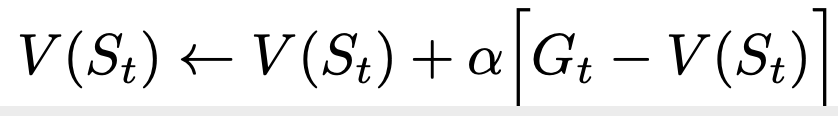
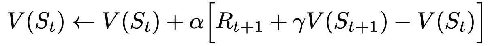
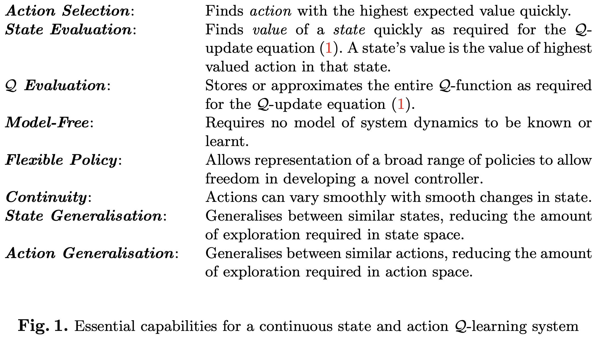
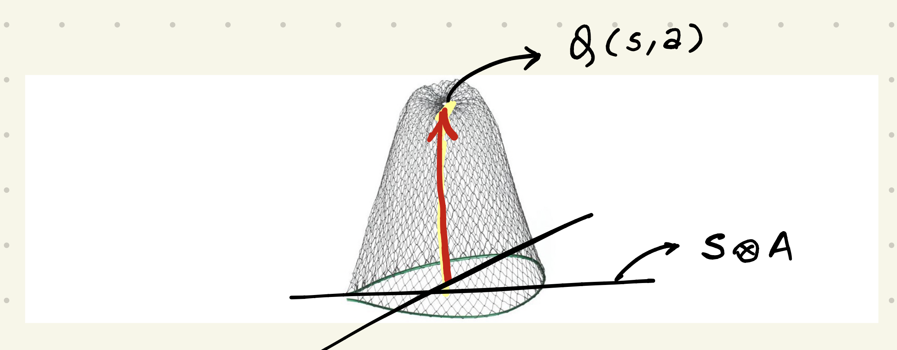

#### Autonomous Air Traffic Conflict-Resolution

We are using reinforcement learning to develop an air-traffic controller DQN. Here, I'm conducting preliminary investigation as part of a larger group project.
 

I'm currently implementing 2-aircraft conflict-resolution. We eventually want to generalize this to *n* aircrafts, and provide rigorous safety guarantees for the learnt policy.

***

#### INSTALLATION
Installing dependencies,
- On **MacOS** with Python 3.6x, use `pip install -r requirements.txt`
- On **MacOS** with Python 3.7x, check `README_VENV.md` for instructions.
- On **Windows/Linux** you can install the Python(x,y) bundle which has all the dependencies. See resources below.

Running BlueSky,
- Run `python check.py` to verify BlueSky installation.
- Run `python BlueSky.py` to launch the gui.
- Use the Bluesky command `IC ML/2-AC.scn` to view the two-aircraft conflict scenario.

#### RESOURCES
[Official BlueSky Wiki](https://github.com/TUDelft-CNS-ATM/bluesky/wiki)  
[BlueSky Installation Instructions](http://homepage.tudelft.nl/7p97s/BlueSky/download.html)
  
 
---

### *PROBLEM OVERVIEW*
#### DEFINITIONS  
**Conflict-resolution / CR** : The preemptive action that's taken whenever aircrafts are projected to collide with (or come dangerously close to) each other   
**Agent** : The air traffic controller (or the DQN)  
**State** : A tuple that has enough information embedded in it, to render each time-step a Markov Decision Process. 
(Eg. for two aircrafts, it contains information about relative positions and headings of both aircrafts)  
**Action** : The action taken at any time-step (Eg. change of heading by +5)  
**Loss** : Inversely proportional to 'reward' in reinforcement learning. ATC incurs a lower (or no) loss for more desirable conflict-resolution actions, and vice versa.  
**Policy** : The relationship that maps the state to the optimal action at any CR time-step.  
**Episode** : The set of events that take place before the problem 'resets' itself. Conflict-resolution lends itself very well to episodic learning, since the time-step when an aircraft leaves the air-traffic sector can be thought of as a terminal state.

***

#### REINFORCEMENT LEARNING
[Here's](https://medium.com/@m.alzantot/deep-reinforcement-learning-demysitifed-episode-2-policy-iteration-value-iteration-and-q-978f9e89ddaa)
a good, quick review of classical reinforcement learning.

Let the agent's state be *St* at time *t*. The state value V(
*St* ) is the total reward that the agent can expect to
accumulate over the course of the episode (in episodic learning). So in
some sense, it is a learned prediction of the future, based on past
experience. It can be literally be thought of as the 'value' of being in
a state; some states are less beneficial to be in than others.

So a key idea in reinforcement learning is that if we can 'learn' or
approximate these values, we can then use that information to decide
which sequence of actions to take. In theory we would be able to take
the best possible action! Two conventional ways of approximating *V*
using iterative updates are given below.
 
The 1-step monte-carlo update equation is given by,

  

whereas the 1-step temporal difference (TD) update equation is given by,

  
Source : Sutton & Barto   where Gt is the sum
of discounted rewards for the episode, and is known only when the
episode terminates. Monte Carlo updates V at the end of the episode, so
it already knows Gt and can use the exact value for the
update. On the other hand, TD updates using
[bootstrapping](https://datascience.stackexchange.com/questions/26938/what-exactly-is-bootstrapping-in-reinforcement-learning)
(updating an estimate towards an estimate).

Without going into details, Monte-Carlo has lower bias and higher
variance. I chose to use MC over TD, because MC does not involve
bootstrapping. So it is much more stable and less sensitive to
hyper-parameters. And like we mentioned, air-traffic can be easily
formulated as terminating episodes.

The idea of learning the state value V(s) can be extended to that of the
state-action value Q(s,a), i.e. the value of taking action *a* at state
*s*.
#### NEURAL NETWORKS

When the state-action space is continuous, it is infeasible to store
Q-values for each {*s*, *a*} point, so we cannot use classical (tabular)
Q-learning.

Instead, we use a Neural Network that learns a continuous **Q-function**
Q(s,a). Once Q is learnt (i.e. *Q* &rarr; *Q**), the optimal (greedy)
policy is then &pi;* = *argmax*a*Q**(s,a).

The qualities desirable from a Q-Learning Neural Net implementation are,

  
 Source: http://users.cecs.anu.edu.au/~rsl/rsl_papers/99ai.kambara.pdf 

#### EFFECT OF CORRELATION IN TIME-SERIES DATA 

A naive implementation of a DQN is very likely to diverge due to the correlation between adjacent state-action transitions. For eg. consider a temporal difference update at {s,a}. 

  
 Source: ? 

The update also 'pulls' with it all the Q-values in its neighborhood - a consequence of approximating Q(s,a) with a continuous function.

Two popular rectifications for this problem are :

- **Experience Replay** : Let a *transition* be the set of
  state-action-return observed at a time-step. Store these transitions
  in a memory buffer. After sufficiently many transitions, use an i.i.d.
  sample of recently experienced transitions to update the DQN.
- **Network Switching** : Developed by Deepmind and subsequently
  incorporated into Tensorflow, actions are taken based on one network,
  while the target Q-function is stored in another network that's kept
  frozen for T iterations. At the Tth iteration both networks
  are synchronized. This solves the problem of having to 'chase a moving
  target'. This method is compatible with multi-step learning methods.